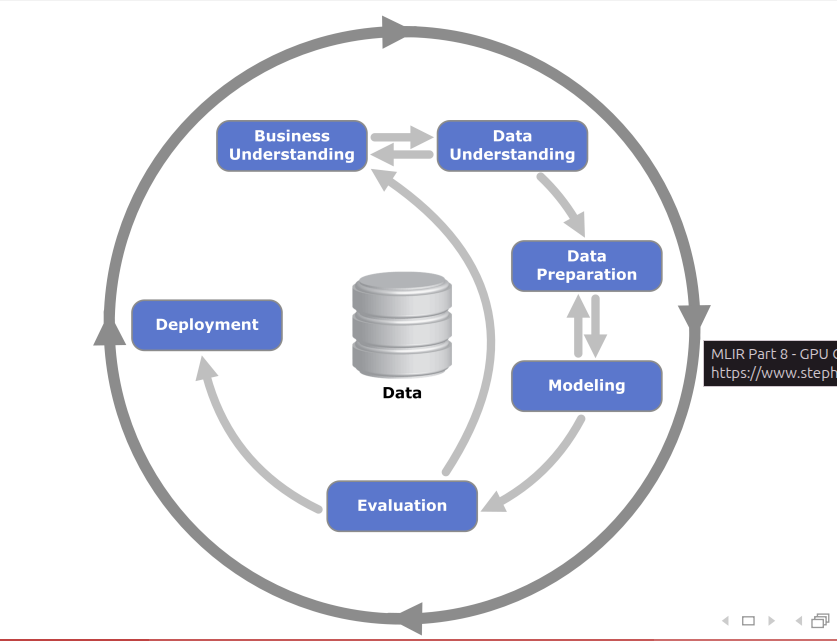

Data mining is a process, it can't be done with the push of a button (single step)

**CRISP (Cross Insustry Standard Process for Data Mining) is a metodology that defines the multiple steps needed to setup the data mining process**

- we have the data and the buisness needs/objectives
  - buisness inteso in senso lato come obiettivo/purpose
- le frecce indicano a flow of data and decisions
- i need to know what i want and what i have available (**business understanding and data understanding)**
  - ho un obiettivo ma noto che non i dati per raggiungerlo
  - oppura guardo prima i dati e aggiusto i miei obiettivi
  - posso ricalibrare i miei obiettivi oppure ottenere nuovi dati
  - **NB**: dal buisness understanding recupero gli obiettivi anche per i miei modelli
    - ho bisogno di accuracy dell'85%, recall dell' ...
- data understanding tasks
  - Collect Initial Data
  - Explore Data
  - Verify Data Quality (imbalances, missing values, wrong values, outliars, ...)
- data preparation
  - labeling
  - feature engineering, and selection
  - trasformazioni varie come standardization/normalization e data cleaning (come in ETL)
  - select important data
- modelling (80% of the course)
  - uses the data produced by data preparation as an input to produce a machine learning model
  - a certain kind of modelling may need to a data prepared in a specific way (nota double arrow)
  - Some important decisions here are
    - selecting the Modeling Technique
    - tuning the model with hyperparameter settings
- we evaluate the quality of the model produced by modelling according to the metrics defined in the buisness understanding step
  - the result of the evaluation potrebbe farmi cambiare idea sui miei obiettivi (nota freccia che torna indietro)
  - ad esempio se noto che il mio modello non è soddisfacente nonostante abbia fatto tutto bene
  - le metriche non sono solo sul modello ma anche, ad esempio, sul costo di una misprediction
- finally we deploy the model and use it for our buisness purposes

**NB**: Il tutto è un processo continuo dato che dopo un anno potrei rifare tutto da capo se i miei obiettivi, o altro, sono cambiati

data preparation could take 80% of the resources

deployment non ci interessa
