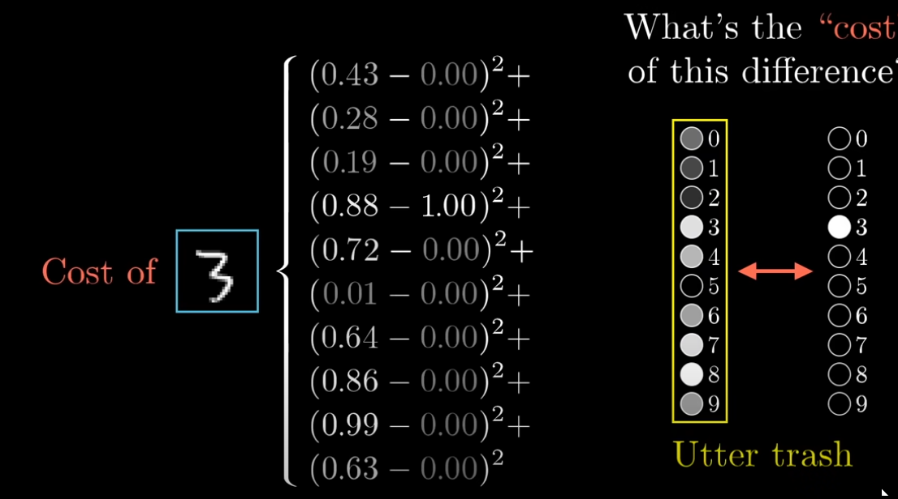
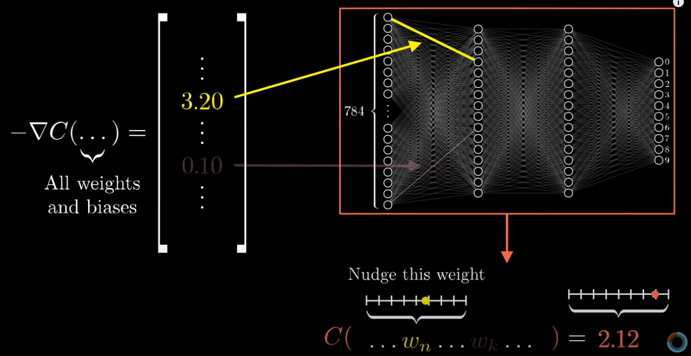
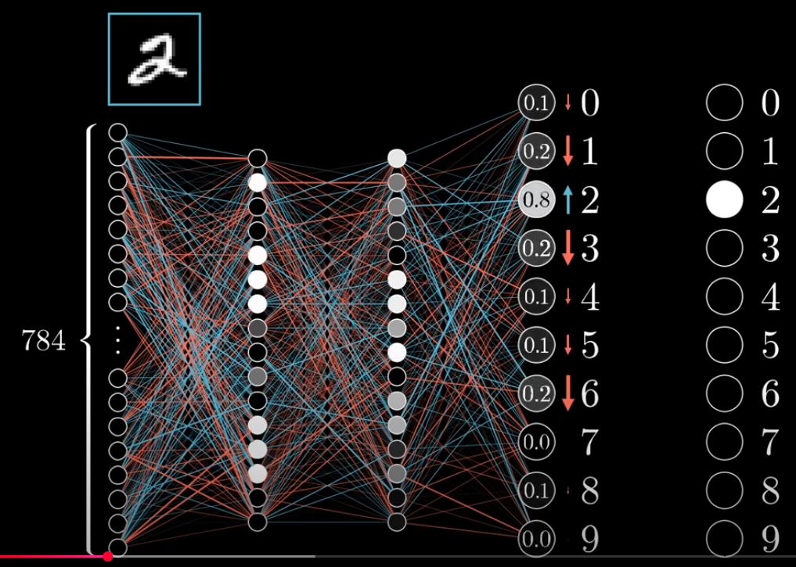
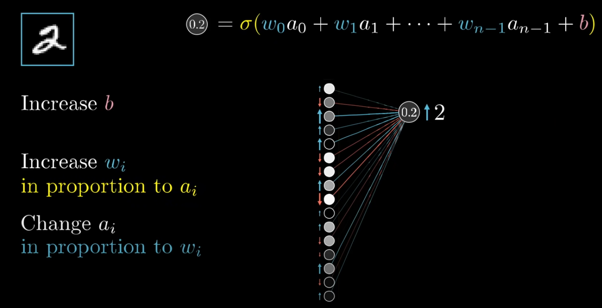
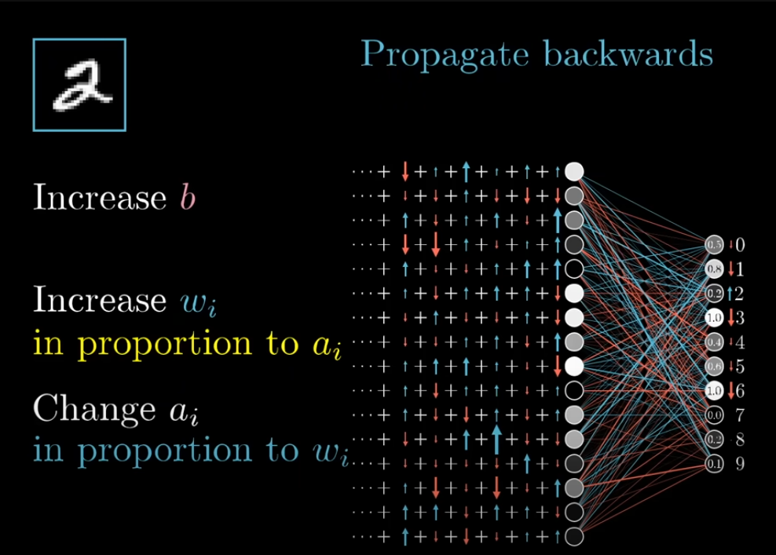

### Funzione di errore
L'errore di un singolo esempio e dato dalla somma di varie componenti. Le singole componenti che vengono sommato sono dal quadrato della differenze delle componenti vettore dell'uscita corrente della rete con il vettore delle uscite desiderate dell'esempio fornito in ingresso
- quadrato per far si che l'errore sia sempre positivo

L'errore totale della rete è ottenuto sommando i singoli errori di ogni esempio nel training set, e facendo la media aritmentica di questa somma
- in questo modo si riesce a calcolare una stima di quanto la rete sia lontana dal produrre il risultato desiderato considerando tutte i possibili input, e non solo un particolare esempio

L'errore della rete (sia singolo che totale) è una funzione di tutti i pesi e bias
- L'attivazione dell'ultimo livello di uscita dipende dai pesi e bias di quel livello, e dalle attivazioni del livello precedente
- Ma le attivazioni del livello precedente dipendono dai propri pesi e bias, e dalle attivazioni del livello precedente ancora
- ...
- Insomma, la funzione di errore si ottiene espandendo le attivazioni di tutti i livelli fino ad arrivare al livello di input

### Discesa del gradiente
Facendo la discesa del gradiente di questa funzione di errore, otteniamo un vettore (l'opposto del gradiente) che ci dice come modificare questi pesi e bias per ottenere la diminuzione dell'errore più efficente e rapida.
- la riduzione dell'errore tramite discesa del gradiente è come la rete "apprende"

è utile pensare al gradiente non come ad una direzione in una spazio n-dimensionale, ma piuttosto, come ad una misura di quali sono i pesi che impattano di più nel diminuire l'errore. 

In altri termini, il valore assoluto di ogni componente del gradiente ci dice quanto la funzione di errore è sensibile rispetto alle variazioni di ogni singolo peso e bias (vettore delle derivate parziali)    
- se una componente ha valore assoluto alto, piccole variazioni di quel peso/bias produrranno grandi variazioni dell'errore
- se una componente ha valore assoluto basso, grandi variazioni di quel peso/bias produrranno modeste variazioni dell'errore
- **derivata parziale alta === velocità di variazione alta** e viceversa

### Backpropagation
questo è un algoritmo che permette di computare il gradiente citato sopra (passo durante la discesa).

Partiamo considerando un singolo esempio: un 2. Che effetto dovrebbe avere questo 2 sui pesi e bias della rete?

1. Concentriamoci inizalmente sul livello di output: **la variazione delle attivazioni dell'ultimo livello dovrebbe essere proporziale a quanto questi valori si discostano dal loro valore obiettivo**
    - se un attivazione è vicina al suo obiettivo va variata di poco; va variata invece di tanto altrimenti
    - es. Incrementare l'attivazione del neurone 2 è più importante rispetto a diminuire l'attivazione del neurone 8

2. Concetriamoci adesso su un singolo neurone del livello di output. Da che cosa dipende la sua attivazione? Come facciamo a incrementarla/decrementarla?
    - L'attivazione di un neurone dipende da una somma pesata di tutte le attivazioni del livello precedente, sommato a un bias, il tutto dato in pasto ad una funzione attivazione (sigmoid, ReLU, ...)
    - Abbiamo quindi tre opzioni per aumentare/diminuire l'attivazione del nostro neurone in uscita
        - incrementare i pesi del neurone in uscita
            - in questo caso notiamo che i pesi hanno capacità diverse di variare l'attivazione del neurone di uscita
            - **i pesi corrispondenti ad attivazioni del livello precedente grandi in valore assoluto, hanno un'influenza maggiore** rispetto a quelli relativi ad attivazioni più piccole
        - incrementare il bias del neurone in uscita
        - modificare le attivazioni del livello precedente
            - se le attivazioni del livello precedente che hanno un peso positivo vengono incrementate e/o quello che hanno un peso negativo vengono diminuite, allora l'attivazione del neurone in uscita sale
            - similmente al variare i pesi, **otteniamo un incremento maggiore dell'attivazione del neurone in uscita se facciamo variare le attivazioni del livello precedente corrispondenti a pesi grandi in valore assoluto** 
            - **attenzione**: non possiamo modificare direttamente le attivazioni del livello precedente, possiamo solo modificare i pesi e i bias della rete.

3. Quanto detto fino ad ora considera solo un singolo neurone del livello di output. Ogni altro neurone del livello di output ha i propri desideri riguardanti le variazioni dei pesi, bias e attivazioni del livello precedente che producono la variazione desiderata nella propria attivazione
    - i desideri (variazioni dei pesi, bias e attivazioni precedenti) di tutti i neuroni del livello di output vengono sommate insieme per produrre il **vettore di variazioni finali desiderate dal penultimo livello** (simile a punto 1 ma per un livello nascosto)
    - una volta ottenuto il vettore di variazioni finali desiderate dal penultimo livello, possiamo **riapplicare ricorsivamente lo stesso procedimento** per ottenere il vettore di variazioni finali del livello prima ancora 
    - è in questo senso che l'algoritmo **propaga all'indietro**, si parte dalle variazioni desiderate dall'ultimo livello e mano a mano di ottengono le variazioni desiderata dai livelli precedenti

4. Quanto detto fino ad ora considera solo un singolo esempio di training, se considerassimo solamente questo esempio, la rete diventerebbe brava a classificare solamente dei due.
    - quello che succede è che si ripete lo stato procedimento di backpropagation per ogni esempio di training
    - in questa maniera otteniamo il vettore di variazione dei pesi e bias desiderato da ogni esempio
    - ottenuti questi vettori, la variazione finale effettiva dei pesi viene effettuata facendo una media
        - questa variazione effettiva è, a tutti gli effetti, il gradiente negativo della funzione di errore
    - in questa maniera la rete diventa un po' più brava a classificare tutti i possibili output  

5. A questo punto si tratta di iterare fino a che non si converge in un minimo locale

### Stocastic gradient descent
Siccome considerare tutti gli esempi del training set per ogni singolo passo di discesa del gradiente è troppo computazionalmente costoso, cio che si fa nella pratica è considerare per ogni passo solamente un sottoinsieme del training set.
- in questa maniera non si effettua il passo che causa precisamente la diminuzione più ripida dell'errore
    - il gradiente della funzione dipende da tutti gli esempi
- stiamo però facendo una buona approssimazione computazionalmente fattibile