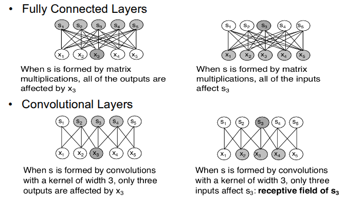

CNNs are a specialised kind of NN for processing data  that have a known grid-like topology:
- Time series data (1D grid)
- Image data (2D grid)

CNNs employ a mathematical operation called  convolution

CNNs are NNs that use convolution in place of general matrix multiplication in at least one of their layers

**NB**: I pesi non sono più quelli di una somma pesata. I pesi rappresentano i valori di vari filtri convoluzionali
- Nelle NN classiche si imparano pesi tra neuroni.
- Nelle CNN si imparano pesi dei filtri (kernel), che poi vengono applicati su tutta l'immagine per estrarre le feature rilevanti.

Convolutional networks leverage three important ideas that improve a machine learning system:
1. Sparse interactions
2. Parameter sharing
3. Equivariant representation

### Sparse interactions
Traditional networks connect each neuron of a layer with ALL neurons of adjacent layers
- **Each output is influenced by all inputs**
- e viceversa, **Each single input influences all outputs**

In CNN instead there is a **significantly lower number of  connections**
- For instance, in an image with thousands or millions of  pixels we might detect meaningful features with kernels that occupy tens or hundreds of pixels
- Fewer parameters
- Reduced memory requirement
- Improves efficiency

### Parameter sharing
Parameter sharing refers to use the same parameter for more than one function in a model

In traditional networks **each element of the weight matrix is used exactly once** when computing the output of a 
layer
- it is multiplied by the input and then never revisited

In a CNN **each member of the kernel is used at every position of the input** (except for the boundaries)
- Rather than learning a separate set of parameters for every location, we learn one set

### Equivariance
In case of convolution, the particular form of parameter  sharing causes the layer to have a property called equivariance to translation

f(x) is equivariant to a function g if f(g(x)) = g(f(x))
- **if the input changes, the output changes the same way**

Convolution is not equivariant to rotations, changes in scale etc.

### Pooling
Pooling aggregates the output at a certain location with a **summary statistic of the nearby output**

Common pooling functions:
- max pooling operation reports the max output within a rectangular neighborhood
- average of a rectangular neighborhood
- L^2 norm of a rectangular neighborhood
- weighted average based on the distance from the central pixel

Pooling helps to **make a representation invariant to small changes of the input**
