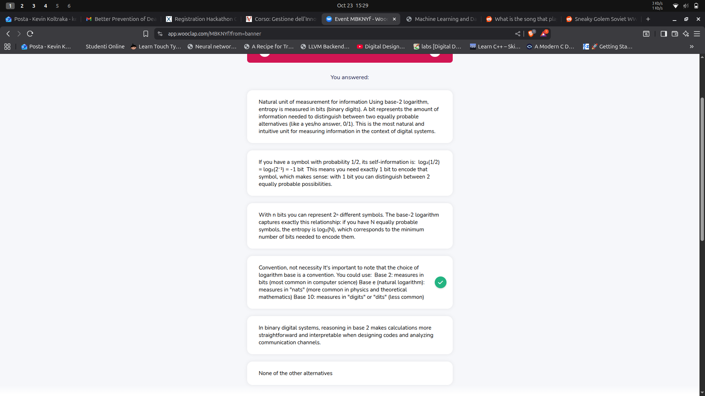

Cos'è un decision tree?

- A tree–structured plan generating a sequence of **tests on the known attributes** (predictors) to **predict the values of an unknown attribute**
- A run–time classifier structured as a decision tree is a **tree–shaped set of tests**
  - anche chiamato c4.5
- i nodi intermedi sono le domande
- le foglie sono le classification/decisioni
- The training process builds the tree
- The classification process walks the tree

# Decision tree model generation

Se il set non ha una classe univoca ma è _piccolo_, just take the majority

- ... cosa significa _small_ number?

I test conviene farli sempre binari

- non si guadagna granchè a scegliere dei test con più outcomes

...

We'll use information theory to find interesting patterns

Problems to solve:

1. which attribute should we test?
2. which kind of test?
    2.1 binary, multi–way, . . . , depends also on the domain of the attribute
3. what does it mean X is small, in order to choose if a leaf node is to be generated also if the class in X is not unique?

## Entropia

- misura dell'information content
- segno - per correggere il logaritmo di numeri minori di 1
- guarda slide 33 in avanti

**Cosa significa intuitivamente**

- Entropia alta = confusione
  - non so cosa mi arriva, probabilità simili
  - Se un simbolo è molto improbabile, porta più informazione → più bit per rappresentarlo
- Entropia bassa = probabilità skewed
  - mi aspetto che mi arrivi il simbolo con probabilità più alta
  - Se un simbolo è molto probabile, non porta quasi nessuna informazione nuova → pochi bit per rappresentarlr

L’entropia è quindi la media pesata di “quanta informazione” portano i simboli, calcolata sulla loro probabilità

**Perché c’è il logaritmo?**

L'informazione di un evento con probabilità p è: I=−log_2(p)

- Se p=1 → I=0 bit
  - (niente sorpresa: evento certo)
- Se p=1/2 → I=1 bit
- Se p=1/8 → I=3 bit
  - (serve più informazione per descriverlo)

Quindi l’entropia è: H(X) = **media pesata per probabilità dell’informazione dei simboli**

- l'entropia misura quanta informazione produce in media la sorgente.
- Quindi facciamo la media pesata: ogni simbolo contribuisce in proporzione a quanto spesso compare.

**Oss**: Shannon scelse il logaritmo come funzione per rappresentare la quantità di informazione dato che cercava una funzione che doveva possedere certe proprietà. A noi non interessa

**Perchè base 2?**



## Entropia delle classi

Considereremo l'entropia delle classi

- In classification, low entropy of the class labels of a dataset means that it is there is low diversity in the labels
  - (i.e. the dataset has high purity, there is a majority class)
- **We look for criteria that allow to split a dataset into subsets with higher purity**
  - questo sarà il nostro test
- Splitting the dataset in two parts according to a threshold on a numeric attribute the entropy changes, and **becomes the weighted sum of the entropies of the two parts**

### Information Gain

It is the reduction of the entropy of a target class obtained with a split of the dataset based on a threshold for a given attribute

- intuitivamente, dividendo il dataset abbiamo ridotto la casualità delle classi (entropia) imparando che da una parte è facile che ci siano elementi di classe c1 e dall'altra parte altro

**With this we have a rule for defining the best split (best threshold t) IF WE CHOOSE AN ATTRIBUTE** -> the one that maximizes the information gain

Slide 44 - in teoria l'ultimo predictor dovrebbe avere IG = 0

- non è così a causa di randomness
- the bigger is the dataset, the more attenuated this random effect is

slide 51 - dopo lo split l'entropia totale si è ridotta

- abbiamo eliminato un po' di confusione con il nostro split
- da un lato siamo puri
- dall'altro abbiamo praticamente solo due classi invece delle tre iniziali
- in generale, dopo lo split cio che si riduce è la weighted (by sample %) of the entropy of the descendants

## DT generation

Rimane da capire che attributo scegliere?

- semplicemente, provali tutti e vedi quello che massimizza l'IG
- test the attribute which guarantees the maximum IG for the class attribute in the current split

A questo punto abbiamo attributo e threshold

- partition X according to the test outcomes
- recursion on the partitioned data

When do i stop the recursion?

- when there's purity
- when we can't get any positive information gain

**NB**: siccome stiamo considerando solo un attributo alla volta per i test, stiamo praticamente disegnando linee verticali/orizzontali per dividere il nostro dataset

## Algoritmo e complessità

algoritmo è immediato

per ogni nodo intermedio

- devo scorrere tutti gli attributi e capire qual'è quello che mi da il massimo IG
- ce ne sono D

per fare quanto detto sopra

- devo scorrere tutte le istanze all'interno del mio split corrente per capire quali vanno da una parte e quali dall'altra
- in questo modo riesco a calcolare l'impurità (entropia o quello che è)
- ogni livello dell'albero richiede di valutare tutto il dataset
  - i nodi di un livello sono il dataset splittato

ho log(n) livelli

Unendo i contributi ho la complessità dell'algoritmo

Nota: L'implementazione scikit-learn parla di impurità al posto di entropia

- questo perchè l'entropia non è l'unica funzione di impurità possibile

## other purity functions

Abbiamo visto che per scegliere quale attributo usare nella generazione degli split del decision tree

- we're looking for the split generating the maximum purity (= riduzione di impurità = information gain)
- we need a measure for the (im)purity of a node
  - abbiamo visto entropia
  - ma ne esistono anche altri

The Gini Index is the total probability of wrong classification

- consideriamo un nodo p con Cp classi al suo interno
- facciamo finta di classificare a caso
- For class j definiamo
  - frequency fp,j -> probabilità di prendere un elemento di classe j
  - frequency of the other classes 1 ´ fp,j -> probabilità di prendere un elemento di classe diversa da j
  - probability of wrong assignment fp,j * (1-fp,j)
    - probabilità di prendere un elemento della classe j e di classificarlo come diverso da j
    - uguale anche viceversa
- il gini index è la sommatoria delle probabilità di wrong assignment per tutte le classi j

This is the default impurity measure in Scikit-Learn

Di nuovo quando facciamo uno split scegliamo l'attributo e il treshold che mi massimizza la riduzione del Gini Index (impurità)

# Model error

Training set error of decision trees can be > 0

- decision trees by their nature can't discriminate data perfectly in any dimension
- they use only horizontal and vertical lines to discriminate classes
- that means that some cases can't be perfectly classified (ricorda VC dimension)

**training set error is the lower bound of the error we can expect when classifying new data**

the **test set error** is more indicative of the **error with new data**

- usually it's much worse than the training set error

# Overfitting

A decision tree is a hypothesis of the relationship between the predictor attributes and the class.

h overfits the training set if there is an alternative hypothesis h' such that:

```
error_train(h) < error_train(h') 
error_X(h) > error_X (h') ; con X = intero dataset
```

L'idea è che il modello si è troppo parametrizzato per il training set (che può, ad esempio, non essere bilanciato) e non riesce a generalizzare su new data

## Cause di overfitting

Overfitting happens when the learning is affected by noise

- When a learning algorithm is affected by noise, the performance on the test set is (much) worse than that on the training set

1. Presence of noise
    - individuals in the training set can have bad values in the predicting attributes and/or in the class label, or can represent unusual cases in this case, the model is influenced from partly wrong or unusual training data
2. Lack of representative instances (unbalanced dataset)
    - some situations of the real world can be underrepresented, or not represented at all, in the training set this situation is quite common

A good model has low generalization error i.e. it works well on examples different from those used in training

## Pruning decision trees

**NB**: A long hypothesis that fits the (training) data is more likely to be a coincidence than a pattern

Pruning decision trees is a way of reducing overfitting.

How do we prune?

- se tagliamo troppo -> high bias -> we're considering only a few parameters as our predictors
- se tagliamo troppo poco -> high variance -> we've learned noise

### hyperparameters

Every model generation algorithm can be adjusted by setting specific hyperparameters

Each model has its own hyperparameters

One of the hyperparameters of decision tree generation is the **maximum tree depth**

# Characteristics of DTs induction (training)

redundant attributes do not cause any difficulty

- in DTs if we choose one or the other to partition the data it doesn't make that much of a difference because splitting considering one automatically split also with the other
- this is not true for other classification methods

DT building is a greedy algorythm

- At every decision point, the choice is made that guarantees the maximum immediate gain (maximum impurity reduction)

Overfitting can be controlled by adjusting the maximum tree depth

In practice

- the impurity measure has low impact on the final result
- the pruning strategy has high impact on the final result

### Questions

2) Se l’albero mette “marital status” vicino alla radice, vuol dire che il matrimonio è una causa della ricchezza?

No.
Vuol dire solo che è un attributo fortemente predittivo nel dataset, non che causa la ricchezza.

L’albero estrae correlazioni, non causalità.
Dire “marital status → wealth” sarebbe una fallacia causale (confondendo correlazione con causalità).

Messaggio chiave: i decision tree non dimostrano cause, solo relazioni predittive.

3) Se un attributo non appare nell’albero, vuol dire che non influisce sulla ricchezza?

Anche qui: no.

Un attributo può non apparire nell’albero per diversi motivi, ad esempio:

- è ridondante (altro attributo spiega le stesse informazioni)
- ha un effetto debole ma reale
- è rilevante ma solo in combinazione con altri attributi (che l’albero non ha catturato)
- l’albero è stato potato
- il modello greedy ha fatto scelte locali che l’hanno escluso
